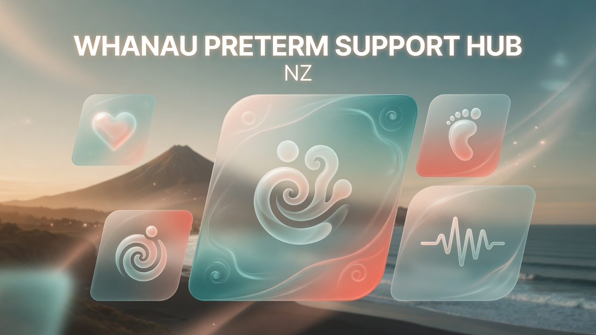
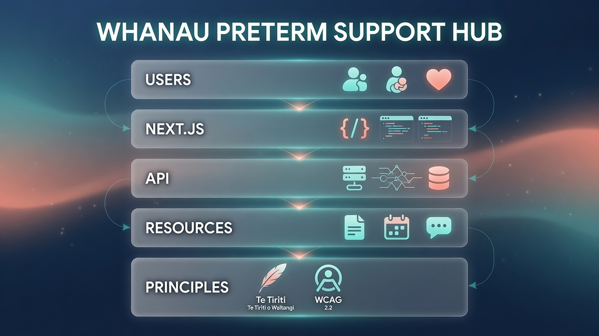
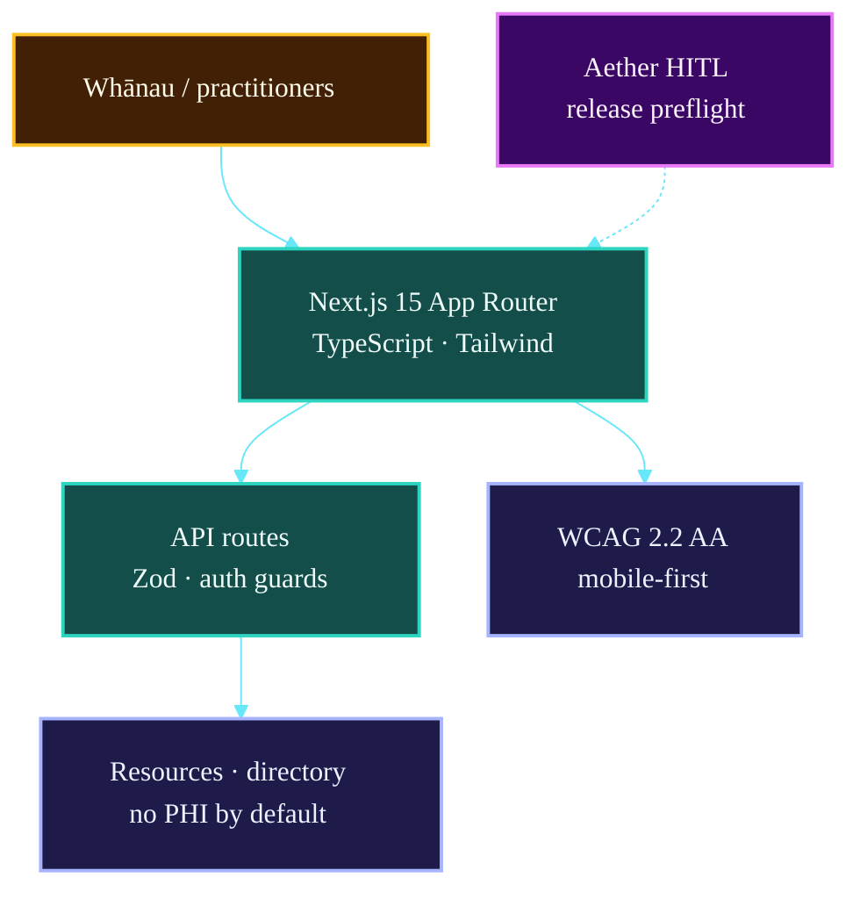

# Whānau Preterm Support Hub NZ

[](./LICENSE)
[](https://nextjs.org)
[](https://www.typescriptlang.org)

[](https://github.com/fivepanelhat/whanau-preterm-support-hub)
[](https://github.com/fivepanelhat/whanau-preterm-support-hub)
[](https://github.com/fivepanelhat/whanau-preterm-support-hub)

[](https://anthropic.com)
[](https://gemini.google.com)
[](https://openai.com)
[](https://x.ai)

[](https://vercel.com)
[](https://github.com/fivepanelhat/whanau-preterm-support-hub)
[](https://www.temanararaunga.maori.nz)
[](https://github.com/fivepanelhat/whanau-preterm-support-hub)

[](https://github.com/fivepanelhat/whanau-preterm-support-hub/actions/workflows/ci.yml)
[](https://github.com/fivepanelhat/whanau-preterm-support-hub/security/dependabot)




**He waka eke noa — We are all in this waka together.**

A sovereign, open-source, culturally grounded national digital platform supporting whānau and families of preterm twin newborns across Aotearoa New Zealand.

**Current status**: Early development (v0.1.0 scaffold) — public release targeted for late 2026.

## Architecture Overview

A **Next.js** national support hub for whānau of preterm twins — Te Tiriti-aligned, Te Mana Raraunga by design, with Aether-assisted development and strong accessibility defaults.



### System map



| Layer | Components | Role |
| :--- | :--- | :--- |
| **UI** | Next.js 15 + TS | Accessible by default |
| **Data** | General resources only | No PHI by default |
| **Principles** | Te Tiriti · Te Mana Raraunga | Sovereign by design |
| **Dev safety** | Aether + preflight | HITL releases |

*Full detail: [docs/](./docs/)*


For issues, feature requests, or cultural partnership discussions, please open a GitHub Issue or contact the maintainers via the repository.

*Maintained with aroha by the Whānau Preterm Support Hub team and Aether Summit (Senior Lead Developer & Orchestrator).*

---

## Vision

Every whānau in Aotearoa who experiences preterm twin birth has immediate, equitable, culturally safe access to:

- Trusted information and resources (Māori, Pacific, and clinical pathways)
- Peer connection and support
- Clear funding and service navigation (WINZ, DHBs, iwi providers)
- Trauma-informed tools that honour whakapapa, rangatiratanga, and manaakitanga

The platform is built in partnership with whānau, iwi (including Muaūpoko), health professionals, and community organisations. Technology serves people — never the other way around.

## Key Principles

- **Te Tiriti o Waitangi** — Rangatiratanga, kaitiakitanga, manaakitanga, kotahitanga
- **Te Mana Raraunga** — Māori data sovereignty as first-class architecture
- **No PHI by default** — Platform stores only general information and consented resources. Any personal health data remains under whānau control or with their chosen providers.
- **Trauma-informed & culturally safe** by design
- **Accessibility first** — WCAG 2.2 AA minimum, mobile-first, low-bandwidth friendly
- **Open source & sovereign** — Apache 2.0 licence with strong cultural and health disclaimers
- **Agentic development with HITL** — Orchestrated by Aether v0.6.2+ (sovereign multi-agent system) with mandatory human approval gates for all releases and sensitive decisions

## Tech Stack

- **Frontend**: Next.js 15 (App Router) + TypeScript + Tailwind CSS + Radix UI primitives
- **Orchestration & Safety**: Aether v0.6.2 sovereign agentic system (ReAct + skills + release-preflight guardrails)
- **Release Safety**: Custom `hub_release_preflight.py` (adapted from Aether) + GitHub Actions
- **Deployment**: Vercel (primary) + self-host option (Docker)
- **Testing**: Jest + React Testing Library + Playwright (E2E)
- **CI/CD**: GitHub Actions with mandatory preflight job

## Getting Started (Local Development)

```bash
# 1. Clone
git clone https://github.com/fivepanelhat/whanau-preterm-support-hub.git
cd whanau-preterm-support-hub

# 2. Install
npm install

# 3. Run dev server
npm run dev
```

Open http://localhost:3000

### Run Release Preflight (before any tag/push)

```bash
python scripts/hub_release_preflight.py --version 0.1.0
```

The script enforces visibility checks, sensitive file scanning, monotonic versioning, clean tree, and test passage.

## Project Structure (Key Paths)

```
whanau-preterm-support-hub/
├── app/                    # Next.js App Router
│   ├── layout.tsx
│   └── page.tsx            # Public landing + disclaimers
├── components/             # Reusable accessible UI (shadcn/ui style)
├── lib/                    # Utils, constants, cultural helpers
├── docs/
│   └── adr/                # Architecture Decision Records (incl. ADR-0001)
├── scripts/
│   └── hub_release_preflight.py   # Mandatory pre-release guard (Aether-adapted)
├── .github/
│   ├── workflows/
│   │   ├── ci.yml
│   │   └── release-preflight.yml
│   └── ISSUE_TEMPLATE/
├── public/                 # Static assets (images, icons — culturally reviewed)
├── package.json
├── tailwind.config.ts
├── tsconfig.json
├── README.md               # You are here
├── SECURITY.md
├── CODE_OF_CONDUCT.md
├── CONTRIBUTING.md
└── LICENSE
```

## Contribution Guidelines

We warmly welcome contributions from:

- Whānau with lived experience of preterm twin birth
- Māori and Pacific health navigators, midwives, and clinicians
- Iwi and community organisations
- Developers who respect Te Tiriti and data sovereignty
- Cultural reviewers and accessibility specialists

**Before contributing code or content**:
1. Read `CONTRIBUTING.md` and `CODE_OF_CONDUCT.md`
2. For any content touching Māori or Pacific knowledge, partner with cultural reviewers early.
3. All medical/clinical information must include clear disclaimers and be evidence-based.
4. Run `npm run typecheck && npm test` before opening a PR.
5. For releases, the preflight script **must** pass and a human must confirm.

We use conventional commits and squash-merge. Large features are discussed via GitHub Discussions or Issues first.

## Security & Privacy

- **No storage of Protected Health Information (PHI)** without explicit, revocable, granular consent and clear purpose limitation.
- All releases are gated by the release-preflight script (sensitive file detection, clean tree, monotonic versioning).
- Strong defaults for input sanitisation, CSP headers, and rate limiting.
- See `SECURITY.md` for reporting vulnerabilities.

## Health & Medical Disclaimer

**This platform is not a substitute for professional medical advice, diagnosis, or treatment.**

Always seek the advice of your midwife, doctor, or other qualified health provider with any questions you may have regarding a medical condition or pregnancy. Never disregard professional medical advice or delay in seeking it because of something you have read on this platform.

If you are in crisis or experiencing distress, please contact:
- Your midwife or lead maternity carer immediately
- Healthline: 0800 611 116
- In emergency: 111

## Licence

Apache License 2.0 — see `LICENSE` file.

With additional cultural and health disclaimers as noted above.

## Acknowledgements

- Whānau and families who have walked this path and generously shared their knowledge
- Muaūpoko Tribal Authority and other iwi partners
- Mana Kai / Horowhenua community resilience network (inspiration for sovereign tech + community models)
- Aether sovereign agentic system (fivepanelhat/Aether) — our orchestrator and safety layer
- All open-source contributors who prioritise equity, accessibility, and cultural safety

**He waka eke noa.**
